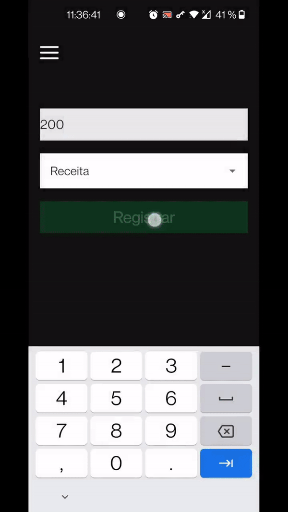

## finanças

Você pode ver o app em funcionamento nesse video: https://aaronmoreiracampos-drive.mycozy.cloud/public?sharecode=SOgxpESNSpfA

## Instruções de uso

Abra o diretório financas no terminal

// necessário ter o expo instalado, caso não tenha digite npm install expo

### `expo install`

Dentro do diretório financas, digite expo install para instalar as dependências utilizadas no projeto

### `npm start`

Use npm start para rodar o expo

## Login

## NavBar

## Home

## Registrar

## Usuário

